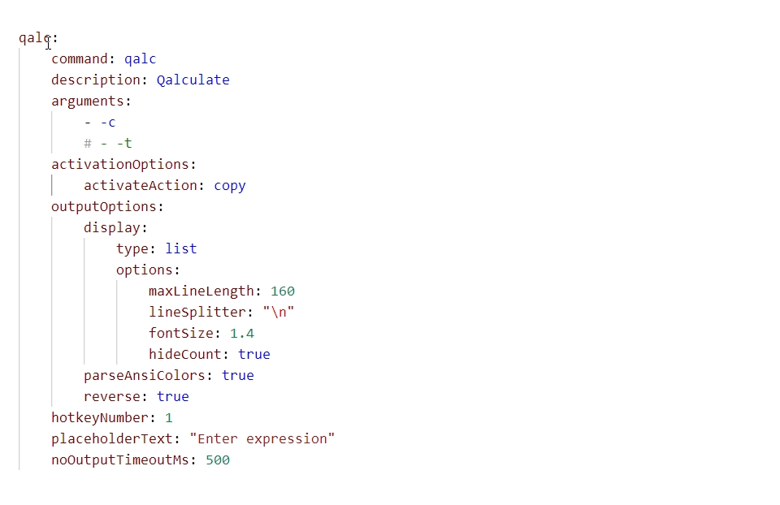
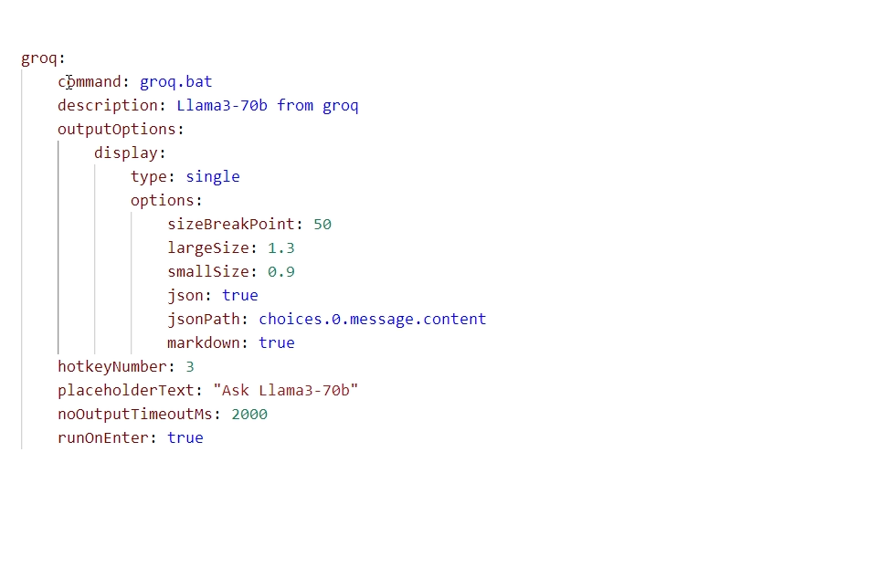

# Dynio

### Converts all commands that run on the cli in windows, linux or macos to a spotlight-like omnibar

### Adding an LLM is trivial

Just copy and paste the curl command they give you in the api tester or write a curl yourself. This demo is 
running llama3-70b (current top rated open source model) on groq. There's no need for streaming as groq runs so fast:

## Installation

Run installer for your OS in releases

## Setup and Usage

1. Start dynio then check `~/.dynio` or `C:\Users\INSERT_YOUR_USERNAME\.dynio`. 
2. Example general settings
command config files will have been created along with their schemas.

If your editor supports 
intellisense or similar for editing yaml files with schema (like vscode does) then it's 
easy to edit both files as the descriptions for all options are in the schema.

The app watches its config dir and will relaunch after any changes.

## Privacy

Open source with signed builds. No data collection BS. No nasty surprises. The app can be built after 
cloning this repo with `tauri build` (after removing the update section from tauri.conf).
