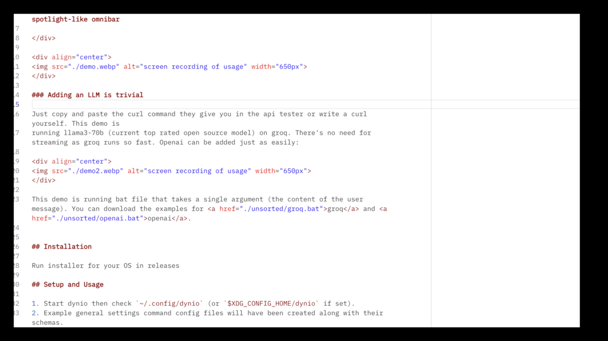
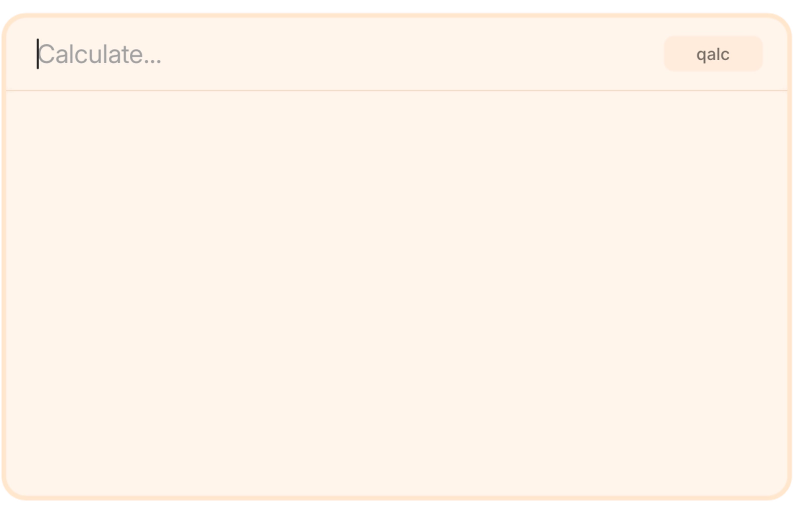

<div align="center">


# Dynio

### Wrap any cli command in a spotlight-like omnibar

[](#installation)
[](#installation)
[](#installation)

</div>


<!-- <div align="center">


*Demnstrating the opening and closing speed. No unnecessary animation. No fading in slowly. Here I'm on macos typing `obs` and thanks to the simple find command (see below), apps from all the application folders on macos are fuzzy sorted using fzf with files underneath.*
</div> -->

<!-- <br /> -->

---

<br />

This provides a spotlight-like GUI to CLI commands. **You edit a yaml with the name of or path to the command and the app calls it and uses its output to create a UI**.

For example: Take the command `ls`. The app calls `ls` each time you press a key with everything you have in the input and then outputs the result as a scrollable and selectable list. You can set an "activation" on each list item (what happens when you select and press enter--this can be basically anything). You could configure the "open" activation which treats the line as a path to be opened* that `ls` outputs (`ls -d`).

- Windows, macOS, Linux
- Global shortcut (Alt/Option+Space) shows/hides instantly
- Yaml config: Full schema with autocomplete in vscod. Paste the schema into an LLM and have it create a command.
- LLM streaming: Chunk-based output for real-time LLM responses with `<think>` block rendering

<br />

\* Mac: `open <path>`, Windows `explorer.exe <path>`, Linux: `xdg-open <path>. 

---

## Demo: Calculator with Qalc

<div align="center">


*[Qalc](https://github.com/Qalculate/libqalculate) is a really cool calculator that understands almost plain-english input. The garish colors here come directly from qalc. I.e. this is parsing qalc's ascii escape chars*
</div>

```yaml
qalc:
    command: qalc # command name or path to the command
    arguments:
        - -t
        - -c
        - -s
        - "upxrates 1"
    description: Calculator (Qalculate)
    hotkeyNumber: 1
    placeholderText: Calculate... 
    noOutputTimeoutMs: 100
    modeConfig:
        mode: single
        displayOptions:
            parseAnsiColors: true
            json: false
        activationOptions:
            activateAction: copy # pressing enter copies the result to the clipboard
```

---

## Demo: LLM Integration

<div align="center">


*Adding an LLM is just a matter of copying and pasting the curl command you get in the code preview panel on most [LLM playgrounds](https://aistudio.google.com/prompts/new_chat). You can get fancier also:*
</div>

```yaml
groq:
    command: "node"
    arguments:
        - "/path/to/groq-ask.js"
    description: Ask Groq a question (uses compound model with web search)
    hotkeyNumber: 3
    placeholderText: Ask Groq...
    runOnEnter: true
    noOutputTimeoutMs: 2000
    modeConfig:
        mode: llm
        displayOptions:
            parseAnsiColors: false
            thinkingDisplay: showWhileThinking
            smallSize: 0.8
            largeSize: 1
            sizeBreakPoint: 100
```

<details>
<summary><b>Example Groq script (TypeScript)</b></summary>

<br />

This uses groq's compound model--which is nice because it has search and browser use. In my testing it had issues differentiating reasoning and actual output so I summarise everything using another LLM.

```typescript
import { Groq } from "groq-sdk";
import process from "node:process";

const userPrompt = process.argv[2];
if (!userPrompt) {
    console.error("Usage: node groq-ask.js <prompt>");
    process.exit(1);
}

const groq = new Groq({
    apiKey: process.env.GROQ_API_KEY, // Noto bene: API key in env var
});

// Stage 1: Call compound model and stream reasoning wrapped in <think></think>
const COMPOUND_SYSTEM_PROMPT = `\
Investigate the user's questions thoroughly by reading high quality sources.
- For technical questions, check the latest official documentation
- For science questions, look at research papers, textbooks, or expert subreddits
- For calculations, use your code interpreter tool
`;

const compoundStream = await groq.chat.completions.create({
    messages: [
        { role: "system", content: COMPOUND_SYSTEM_PROMPT },
        { role: "user", content: userPrompt },
    ],
    model: "groq/compound",
    temperature: 1,
    max_completion_tokens: 1024,
    stream: true,
    compound_custom: {
        tools: {
            enabled_tools: ["web_search", "code_interpreter", "visit_website"],
        },
    },
});

let compoundOutput = "";
process.stdout.write("<think>");

for await (const chunk of compoundStream) {
    const delta = chunk.choices[0]?.delta;
    if (!delta) continue;

    const reasoning = delta.reasoning ?? "";
    process.stdout.write(reasoning);

    const content = delta.content ?? "";
    compoundOutput += reasoning + content;
    process.stdout.write(content);
}

process.stdout.write("</think>\n");

// Stage 2: Call Kimi model to summarize the compound output
const kimiSystemPrompt = `\
Keep your answer highly concise. Include a sources section below the answer
listing best sources from the research as bullet points with title as anchor text.
`;

const kimiStream = await groq.chat.completions.create({
    messages: [
        { role: "system", content: kimiSystemPrompt },
        { role: "user", content: `Examine this research:\n\n${compoundOutput}\n\nAnswer: "${userPrompt}"` },
    ],
    model: "moonshotai/kimi-k2-instruct",
    temperature: 0.6,
    max_completion_tokens: 4096,
    stream: true,
});

for await (const chunk of kimiStream) {
    const content = chunk.choices[0]?.delta?.content ?? "";
    process.stdout.write(content);
}

process.stdout.write("\n");
```
</details>

---

## Demo: File Search

<div align="center">


*This is extremely fast and shows system applications like TextEdit. You could get really fancy by adding [frecency](https://en.wikipedia.org/wiki/Frecency) to the find script and a custom activation script that updates frequency scores*
</div>

```yaml
find:
    command: /path/to/custom-find.sh
    description: Search files using Spotlight. Apps shown first.
    hotkeyNumber: 2
    placeholderText: Search files
    noOutputTimeoutMs: 150
    modeConfig:
        mode: list
        displayOptions:
            parseAnsiColors: true
            stderrFilterRegex: "\\[UserQueryParser\\]"
            maxLineLength: 160
            lineSplitter: "\n"
            fontSize: 0.8
        activationOptions:
            activateAction: open
            hideOnActivation: true
            isPath: true
```

<details>
<summary><b>Example macOS find script (with fzf)</b></summary>

```bash
#!/bin/bash
query="$1"

[[ ${#query} -le 2 ]] && exit 0

{
    # Application folders (not indexed by Spotlight)
    ls -1d /System/Applications/*.app 2>/dev/null
    ls -1d /System/Applications/Utilities/*.app 2>/dev/null
    ls -1d /Applications/*.app 2>/dev/null
    ls -1d /Applications/Utilities/*.app 2>/dev/null
    # Non-applications via Spotlight (excluding home folder)
    mdfind "kMDItemFSName == '*$query*'c && kMDItemKind != 'Application'" 2>/dev/null | grep -v "^$HOME"
} | fzf --filter "$query"
```
</details>

---

## Installation

Download the installer for your OS from [Releases](https://github.com/bn-l/dynio/releases).

| Platform | Format |
|----------|--------|
| Windows  | `.exe` (NSIS installer) |
| macOS    | `.dmg` |
| Linux    | `.deb`, `.AppImage` |

---

## Configuration

On first launch, Dynio creates config files at:
- **macOS/Linux**: `~/.config/dynio/` (or `$XDG_CONFIG_HOME/dynio/`)
- **Windows**: `~/.config/dynio/`

| File | Purpose |
|------|---------|
| `cmd-config.yaml` | Command definitions |
| `general-settings.yaml` | App settings (shortcut, theme, etc.) |
| `cmd-config-schema.json` | JSON schema for autocomplete |
| `general-settings-schema.json` | JSON schema for autocomplete |
| `dynio.log` | Debug logs |

The app watches its config directory and auto-restarts on changes.

### General Settings

```yaml
darkMode: false
defaultCommand: find          # Command to use on launch
startMinimised: false         # Start hidden
inputFontSize: 1.8            # Input font size (rem)
alwaysOnTop: false            # Keep window above others
globalShortcut: "Option+Space" # Toggle shortcut (macOS)
hideOnLostFocus: true         # Hide when clicking outside
```

### Command Config Structure

Each command entry supports:

| Option | Description |
|--------|-------------|
| `command` | Path to executable or command name |
| `arguments` | Array of command-line arguments |
| `description` | Short description shown in selector |
| `hotkeyNumber` | 1-9 for Cmd/Ctrl+N quick select |
| `placeholderText` | Input placeholder text |
| `noOutputTimeoutMs` | Delay before showing "no output" |
| `runOnEnter` | If true, only run on Enter (not per-keystroke) |
| `currentDir` | Working directory for the command |
| `modeConfig` | Display mode configuration (see below) |

### Display Modes

**List mode** - For commands that output selectable items:
```yaml
modeConfig:
    mode: list
    displayOptions:
        maxLineLength: 200
        lineSplitter: "\n"
        fontSize: 0.8
        parseAnsiColors: true
    activationOptions:
        activateAction: open  # or "copy" or "command"
        isPath: true
        hideOnActivation: true
```

**Single mode** - For calculators, JSON APIs:
```yaml
modeConfig:
    mode: single
    displayOptions:
        json: true
        jsonPath: "choices.0.message.content"
        sizeBreakPoint: 25
        largeSize: 1.5
        smallSize: 1.2
    activationOptions:
        activateAction: copy
```

**LLM mode** - For streaming LLM output with markdown and thinking blocks:
```yaml
modeConfig:
    mode: llm
    displayOptions:
        thinkingDisplay: showWhileThinking  # none, keepHidden, showWhileThinking, show
        thinkingOpenPattern: "<thinking>|<think>"
        thinkingClosePattern: "</thinking>|</think>"
        smallSize: 0.8
        largeSize: 1.0
        sizeBreakPoint: 100
```

---

## Hotkeys

| Shortcut | Action |
|----------|--------|
| `Alt/Option + Space` | Show / Hide (configurable) |
| `Cmd/Ctrl + S` | Show command selector |
| `Cmd/Ctrl + 1-9` | Quick select command 1-9 |
| `Escape` | Close tray / Clear input / Hide |
| `Enter` | Activate selected item (list mode) |
| `Cmd/Ctrl + Enter` | Activate when `runOnEnter: true` |
| `Cmd/Ctrl + O` | Open containing folder (when `isPath: true`) |
| `Ctrl + U/D` | Half-page scroll up/down |
| `Up/Down` | Navigate list items |

---

## Activation Actions

When you press Enter on a selected item:

| Action | Behavior |
|--------|----------|
| `copy` | Copy extracted text to clipboard |
| `open` | Open path/URL in default application |
| `command` | Run a command with the text as argument |

Use `extractorRegexBody` and `extractorGroup` to extract specific parts of each line.

---

## Tips

### Windows
[Scoop](https://github.com/ScoopInstaller/Scoop) is great for installing CLI tools:
```powershell
scoop bucket add extras
scoop install qalculate      # Calculator
scoop install everything-cli # Fast file search (requires Everything)
```

---

## Output Processing

**List and Single modes** read output line-by-line. Data displays when a newline (`\n`) is received.

**LLM mode** uses chunk-based reading instead, so tokens appear immediately without waiting for newlines.

---

## Privacy

- Open source with signed builds
- No data collection
- Single update check on launch to this repository's releases (i.e. to github.com)
- Can be built from source with `tauri build` (remove updater section from `tauri.conf.json`)

---

## Troubleshooting

**Windows WebView**: On older Windows versions, WebView2 should auto-install. Manual install: https://go.microsoft.com/fwlink/p/?LinkId=2124703

**Logs**: Check `~/.config/dynio/dynio.log` for debug output.

**Config errors**: The app validates YAML against schemas on startup. Check logs for validation errors.

---

## License

[AGPL-3.0](LICENSE)
