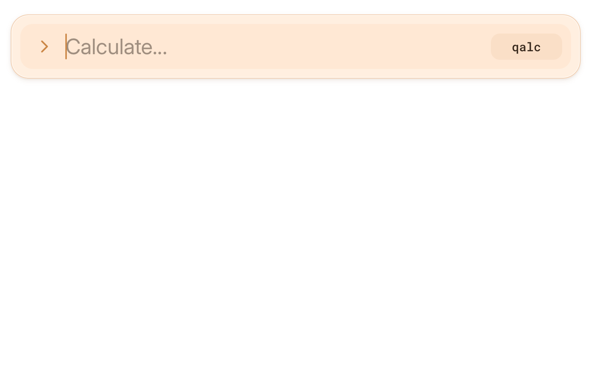
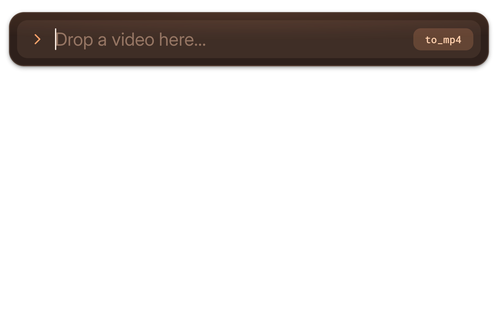
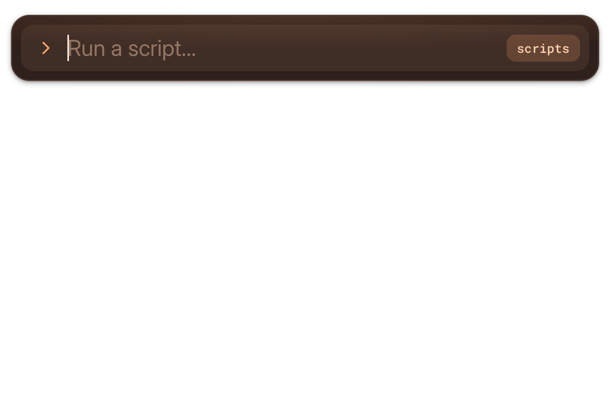

<div align="center">


# Dynio

### Wrap any cli command in a spotlight-like input bar

[](#installation)
[](#installation)
[](#installation)

</div>


---

<br />

This provides a spotlight-like GUI to CLI commands. **You edit a yaml with the name of or path to the command and the app calls it and uses its output to create a UI**.

For example: Take the command `ls`. The app calls `ls` each time you press a key with everything you have in the input and then outputs the result as a scrollable and selectable list. You can set an "activation" on each list item (what happens when you select and press enter--this can be basically anything). You could configure the "open" activation which treats the line as a path to be opened* that `ls` outputs (`ls -d`).

- Windows, macOS, Linux
- Global shortcut (Alt/Option+Space) shows/hides instantly
- Yaml config: Full schema with autocomplete in vscode. Paste the schema into an LLM and have it create a command.
- LLM streaming: Chunk-based output for real-time LLM responses with `<think>` block rendering
- Drop a file on the bar to put its path in the input
- Light and dark themes

<br />

\* Mac: `open <path>`, Windows: `explorer.exe <path>`, Linux: `xdg-open <path>`. 


## Getting started

1. [Install it](#installation)

2. Go to `~/.config/dynio/cmd-config.yaml` on mac and linux, or `%USERPROFILE%\.config\dynio\cmd-config.yaml` on windows

3. Each top level of this file is the name of a "command" in the app (in the demo screeners below this is the badge with "find" or "gpt" or "qalc") and below it is the config for the command. If you open the file in vscode you will have automatic linting and intellisense thanks to the json schema in the folder.

4. At the top of this file, add a new entry:

Macos and Linux:

```yaml
list:
    command: ls  # This is the CLI command to run with the content of the input box
    description: List files
    placeholderText: List files...
    runOnEnter: true  # You press enter after typing a path
    modeConfig:
        mode: list
        displayOptions: {}
        activationOptions:
            activateAction: copy
```

Windows:

```yaml
list:
    command: dir
    description: List files
    placeholderText: List files...
    runOnEnter: true
    modeConfig:
        mode: list
        displayOptions: {}
        activationOptions:
            activateAction: copy
```

(the full structure is [here](#command-config-structure))

That's it. Type a path in the input and press enter to list it. There are some examples below that can be copied and pasted but the possible commands are unlimited. Paste a link to this repo into your LLM of choice and get it to write a script to do anything. 

You can put as many commands as you like in this file. Cmd or Ctrl + s will list all the commands with the hotkey number (another option) set for them.

---

## Demo: File Search

<div align="center">


*This is extremely fast and shows system applications like Photos. You could get really fancy by adding [frecency](https://en.wikipedia.org/wiki/Frecency) to the find script and a custom activation script that updates frequency scores*
</div>

```yaml
find:
    command: /path/to/custom-find.sh
    description: Search files using Spotlight. Apps shown first.
    hotkeyNumber: 2
    placeholderText: Search files
    noOutputTimeoutMs: 150
    modeConfig:
        mode: list
        displayOptions:
            parseAnsiColors: true
            stderrFilterRegex: "\\[UserQueryParser\\]"
            maxLineLength: 160
            lineSplitter: "\n"
            fontSize: 0.8
        activationOptions:
            activateAction: open
            hideOnActivation: true
            isPath: true
```

<details>
<summary><b>Example macOS find script (with fzf)</b></summary>

```bash
#!/bin/bash
query="$1"

# Trigger TCC prompts for dynio to access protected folders (only prompts once). 
#  comment out after first exectution
ls ~/Desktop ~/Documents ~/Downloads >/dev/null 2>&1


[[ ${#query} -le 2 ]] && exit 0

{
    # Application folders (not indexed by Spotlight)
    ls -1d /System/Applications/*.app 2>/dev/null
    ls -1d /System/Applications/Utilities/*.app 2>/dev/null
    ls -1d /Applications/*.app 2>/dev/null
    ls -1d /Applications/Utilities/*.app 2>/dev/null
    # Non-applications via Spotlight (excluding home folder)
    mdfind "kMDItemFSName == '*$query*'c && kMDItemKind != 'Application'" 2>/dev/null | grep -v "^$HOME"
} | fzf --filter "$query"
```
</details>

---

## Demo: LLM Integration

<div align="center">


*Adding an LLM is just a matter of copying and pasting the curl command you get in the code preview panel on most [LLM playgrounds](https://aistudio.google.com/prompts/new_chat). You can get fancier also:*
</div>

```yaml
gpt:
    command: "node"
    arguments:
        - "/path/to/gpt-ask.mjs"
    description: Ask GPT a question (on your ChatGPT plan, through Codex's login)
    hotkeyNumber: 3
    placeholderText: Ask GPT...
    runOnEnter: true
    noOutputTimeoutMs: 2000
    modeConfig:
        mode: llm # <-- !! Nota bene: This is the money mode for LLMs
        displayOptions:
            parseAnsiColors: false
            smallSize: 0.9
            largeSize: 1.1
            sizeBreakPoint: 100
```

<details>
<summary><b>Example GPT script (Node, uses your ChatGPT plan)</b></summary>

<br />

No API key needed: if you have a ChatGPT plan and the [Codex CLI](https://github.com/openai/codex) is signed in (`codex login`), this asks GPT with Codex's login, so it comes out of your plan. It sends the same requests Codex does to an endpoint that isn't a public API, so it can break when Codex changes. When the login runs out it gets Codex to refresh it, so Codex stays signed in. Needs Node 18 or later.

```javascript
// Streams GPT's answer to the prompt in argv[2] to stdout. It runs on your ChatGPT plan with the
// login the Codex CLI keeps in ~/.codex/auth.json, calling the endpoint Codex calls.
import { execFileSync, spawn } from "node:child_process";
import { randomUUID } from "node:crypto";
import { readFileSync } from "node:fs";
import { homedir } from "node:os";
import { createInterface } from "node:readline";
import { Readable } from "node:stream";

const MODEL = "gpt-6.1-sol";
const EFFORT = "low"; // low (its lowest), medium, high, xhigh or max
// Use the full path if Dynio can't find Codex on its PATH, or finds an older copy first
const CODEX = "codex";
const AUTH_FILE = `${homedir()}/.codex/auth.json`;

const SYSTEM_PROMPT = `You answer questions asked from a quick-launch bar, so your answer is read in a small window.

- Be concise. Start with the direct answer, then add only the detail needed to understand or use it. No preamble, no restating the question, no closing summary or offers of further help.
- Structure the answer logically: put things in the order the reader needs them and group related points. Use short headings, lists or tables only when they make the answer easier to scan.
- Use plain, precise language and Markdown. Put code, commands and file paths in code formatting.
- If the question is ambiguous, answer the most likely reading and say in one line what you assumed.
- If you aren't sure of something, say so instead of guessing.`;

const prompt = process.argv[2];
if (!prompt) {
    console.error("Usage: gpt-ask.mjs <prompt>");
    process.exit(1);
}

// Codex sends its version with every request, and each model needs a minimum version
const codexVersion = execFileSync(CODEX, ["--version"], { encoding: "utf8" }).trim().split(" ")[1];

/**
 * Sends the prompt with the same headers Codex uses. The login is read from auth.json every
 * time, because Codex replaces it when it refreshes.
 */
function ask() {
    const { access_token, account_id } = JSON.parse(readFileSync(AUTH_FILE, "utf8")).tokens;
    return fetch("https://chatgpt.com/backend-api/codex/responses", {
        method: "POST",
        headers: {
            Authorization: `Bearer ${access_token}`,
            "chatgpt-account-id": account_id,
            "OpenAI-Beta": "responses=experimental",
            originator: "codex_cli_rs",
            version: codexVersion,
            "User-Agent": `codex_cli_rs/${codexVersion}`,
            session_id: randomUUID(),
            Accept: "text/event-stream",
            "Content-Type": "application/json",
        },
        body: JSON.stringify({
            model: MODEL,
            instructions: SYSTEM_PROMPT,
            input: [{ type: "message", role: "user", content: [{ type: "input_text", text: prompt }] }],
            reasoning: { effort: EFFORT },
            // Codex's "Fast": 2x speed, uses more of the plan's allowance
            service_tier: "priority",
            store: false,
            stream: true,
        }),
    });
}

/**
 * Has Codex refresh its login, which it saves to auth.json. This script never refreshes it
 * itself: every refresh replaces the refresh token, so if two programs did it, one would be left
 * holding a dead one and Codex could be logged out.
 *
 * Codex's app server talks JSON-RPC, one message per line: introduce ourselves (initialize),
 * then ask for the account with a refresh (account/read), and stop when that's answered.
 */
async function refreshLogin() {
    const codex = spawn(CODEX, ["app-server"], { stdio: ["pipe", "pipe", "ignore"] });
    const send = (message) => codex.stdin.write(`${JSON.stringify(message)}\n`);
    send({ id: 1, method: "initialize", params: { clientInfo: { name: "dynio_gpt_ask", version: "1.0.0" } } });
    for await (const line of createInterface({ input: codex.stdout })) {
        const { id, method } = JSON.parse(line);
        // Notifications and requests from Codex have a method; answers to ours don't
        if (method) continue;
        if (id === 1) {
            send({ method: "initialized" });
            send({ id: 2, method: "account/read", params: { refreshToken: true } });
        }
        else if (id === 2) break;
    }
    codex.kill();
}

// The login lasts about 10 days and Codex refreshes it whenever it runs, so it only runs out
// here if Codex hasn't been used for a while
let response = await ask();
if (response.status === 401) {
    await response.body?.cancel();
    await refreshLogin();
    response = await ask();
}

if (!response.ok) {
    console.error(`ChatGPT returned ${response.status}: ${await response.text()}`);
    if (response.status === 401) console.error("Codex couldn't refresh its login. Sign in again with `codex login`.");
    process.exit(1);
}

// The stream is server-sent events: an "event: <type>" line, then a "data: {json}" line
for await (const line of createInterface({ input: Readable.fromWeb(response.body), crlfDelay: Infinity })) {
    if (!line.startsWith("data: ")) continue;
    const event = JSON.parse(line.slice(6));
    if (event.type === "response.output_text.delta") process.stdout.write(event.delta);
    if (event.type === "error" || event.type === "response.failed") {
        console.error(`ChatGPT failed: ${JSON.stringify(event.error ?? event.response?.error ?? event)}`);
        process.exit(1);
    }
}
process.stdout.write("\n");
```
</details>

---

## Demo: Calculator with Qalc

<div align="center">


*[Qalc](https://github.com/Qalculate/libqalculate) is a really cool calculator that understands almost plain-english input, including unit and currency conversions. The garish colors here come directly from qalc. I.e. this is parsing qalc's ascii escape chars*
</div>

```yaml
qalc:
    command: qalc # command name or path to the command
    arguments:
        - -t
        - -c
        - -s
        - "upxrates 1"
    description: Calculator (Qalculate)
    hotkeyNumber: 1
    placeholderText: Calculate... 
    noOutputTimeoutMs: 100
    modeConfig:
        mode: single
        displayOptions:
            parseAnsiColors: true
            json: false
        activationOptions:
            activateAction: copy # pressing enter copies the result to the clipboard
```

---

## Demo: Convert a video with ffmpeg

**Also demoing dark mode**

<div align="center">


*Drop a file on the bar and its path goes into the input. Press enter and the script's output shows up as it runs.*
</div>

The whole input reaches your command as **one argument** so a path with spaces in it is no problems.

In this example script, when it's done, Cmd/Ctrl+Enter opens the new file and Cmd/Ctrl+O shows it in its folder (the script prints the new file's path last, and `extractorRegexBody` picks it out of the output).

```yaml
to_mp4:
    command: /path/to/to-mp4.sh
    description: Convert a video to mp4 (drop it on the bar)
    placeholderText: Drop a video here...
    runOnEnter: true
    modeConfig:
        mode: single
        displayOptions:
            json: false  # NB: "single" mode reads output as JSON unless this is false
            smallSize: 1
        activationOptions:
            activateAction: open
            isPath: true
            extractorRegexBody: "[^\\n]+\\.mp4$"  # the last line: the new file's path
```

<details>
<summary><b>to-mp4.sh (needs ffmpeg)</b></summary>

```bash
#!/bin/bash
# Converts a video to an mp4 next to the original, printing progress as it goes.
# The last line is the new file's path, so Dynio can open or reveal it.
in="$1"
out="${in%.*}.mp4"
size() { du -h "$1" | awk '{ print $1 }'; }
duration=$(ffprobe -v error -show_entries format=duration -of csv=p=0 "$in")

echo "Converting $(basename "$in") ($(size "$in"))"

# -progress prints progress as key=value lines (ffmpeg's usual progress line rewrites itself
# with \r, which never ends a line). awk turns them into a bar every 20%, and fflush() sends
# each line straight away instead of when awk's buffer fills.
ffmpeg -hide_banner -loglevel error -y -i "$in" \
    -c:v libx264 -crf 23 -preset fast -c:a aac -movflags +faststart \
    -progress pipe:1 -stats_period 0.2 -nostats "$out" |
    awk -F= -v total="$duration" '
        function show(pct,   bar, i) {
            for (i = 0; i < 10; i++) bar = bar (i < pct / 10 ? "■" : "□")
            printf "%s %3d%%\n", bar, pct
            fflush()
        }
        $1 == "out_time_us" { while ($2 / 10000 / total >= next_pct + 20 && next_pct < 80) show(next_pct += 20) }
        $1 == "progress" && $2 == "end" { show(100) }
    '

echo "Done: $(size "$in") → $(size "$out")"
echo "$out"
```
</details>

> **Windows and Linux:** with `hideOnLostFocus` on (the default), clicking a file in your file manager hides Dynio before you can drop it, so turn it off to drag files in. On macOS Dynio waits until you let go of the file.

---

## Demo: Run your own scripts

<div align="center">


*Every script in `~/scripts`, searched by name as you type. Enter runs the selected one and Dynio gets out of the way.*
</div>

Why this might be a good idea:

- Keeping all the little scripts and commands you create in one place with a nice fuzzy filtered list to search them.
- Adding a new script is just saving a file: Like Raycast or Alfred script commands, but all you need is a folder with scripts.
- Examples: flush DNS, restart audio, delete merged git branches, back up photos.
- Portable: Keep the folder in your dotfiles and you get the same launcher on every machine.

```yaml
scripts:
    command: /path/to/list-scripts.sh
    description: Run one of my scripts
    placeholderText: Run a script...
    modeConfig:
        mode: list
        displayOptions: {}
        activationOptions:
            activateAction: command
            commandPath: /usr/bin/env  # runs the selected file, using its #! line
            isPath: true               # file icons, and Cmd/Ctrl+O shows the script in its folder
```

<details>
<summary><b>list-scripts.sh (needs fzf)</b></summary>

```bash
#!/bin/bash
# Lists the scripts in ~/scripts, best matches for the input first (matching file names only)
find "$HOME/scripts" -type f -perm -u+x | fzf --filter "$1" --delimiter / --nth -1
```

Each script needs to be executable (`chmod +x`) and start with a `#!` line, like `#!/bin/bash` or `#!/usr/bin/env python3`.
</details>

---

## Installation

**macOS (Homebrew):**
```bash
brew install --cask bn-l/tap/dynio
```

> **Note:** If installing directly from a `.dmg` (not via Homebrew), the app is not yet notarized so macOS may show "app is damaged." Fix with:
> ```bash
> xattr -d com.apple.quarantine /Applications/dynio.app
> ```

**All platforms:** Download the installer for your OS from [Releases](https://github.com/bn-l/dynio/releases).

| Platform | Format |
|----------|--------|
| Windows  | `.exe` (NSIS installer) |
| macOS    | `.dmg` |
| Linux    | `.deb`, `.AppImage` |

---

## Configuration

On first launch, Dynio creates config files at:
- **macOS/Linux**: `~/.config/dynio/` (or `$XDG_CONFIG_HOME/dynio/`)
- **Windows**: `~/.config/dynio/`

| File | Purpose |
|------|---------|
| `cmd-config.yaml` | Command definitions |
| `general-settings.yaml` | App settings (shortcut, theme, etc.) |
| `cmd-config-schema.json` | JSON schema for autocomplete |
| `general-settings-schema.json` | JSON schema for autocomplete |
| `dynio.log` | Debug logs |

The app watches its config directory and auto-restarts on changes.

### General Settings

```yaml
darkMode: auto                # auto | true | false (auto follows system preference)
lightTheme: dusty-peach       # dusty-peach | dusty-peach-inverted
darkTheme: dark-peach         # dark-peach
defaultCommand: find          # Command to use on launch
startMinimised: false         # Start hidden
inputFontSize: 1.5            # Input font size (rem)
alwaysOnTop: false            # Keep window above others
globalShortcut: "Option+Space" # Toggle shortcut (macOS)
hideOnLostFocus: true         # Hide when clicking outside
```

### Command Config Structure

Each command entry supports:

| Option | Description |
|--------|-------------|
| `command` | Path to executable or command name |
| `arguments` | Array of command-line arguments |
| `description` | Short description shown in selector |
| `hotkeyNumber` | 1-9 for Cmd/Ctrl+N quick select |
| `placeholderText` | Input placeholder text |
| `noOutputTimeoutMs` | Delay before showing "no output" |
| `runOnEnter` | If true, only run on Enter (not per-keystroke) |
| `currentDir` | Working directory for the command |
| `modeConfig` | Display mode configuration (see below) |

### Display Modes

**List mode** - For commands that output selectable items:
```yaml
modeConfig:
    mode: list
    displayOptions:
        maxLineLength: 200
        lineSplitter: "\n"
        fontSize: 0.8
        parseAnsiColors: true
    activationOptions:
        activateAction: open  # or "copy" or "command"
        isPath: true
        hideOnActivation: true
```

**Single mode** - For calculators, JSON APIs:
```yaml
modeConfig:
    mode: single
    displayOptions:
        json: true
        jsonPath: "choices.0.message.content"
        sizeBreakPoint: 25
        largeSize: 1.5
        smallSize: 1.2
    activationOptions:
        activateAction: copy
```

**LLM mode** - For streaming LLM output with markdown and thinking blocks:
```yaml
modeConfig:
    mode: llm
    displayOptions:
        thinkingDisplay: showWhileThinking  # none, keepHidden, showWhileThinking, show
        thinkingOpenPattern: "<thinking>|<think>"
        thinkingClosePattern: "</thinking>|</think>"
        smallSize: 0.8
        largeSize: 1.0
        sizeBreakPoint: 100
```

---

## Hotkeys

| Shortcut | Action |
|----------|--------|
| `Alt/Option + Space` | Show / Hide (configurable) |
| `Cmd/Ctrl + S` | Show command selector |
| `Cmd/Ctrl + 1-9` | Quick select command 1-9 |
| `Escape` | Close tray / Clear input / Hide |
| `Enter` | Activate selected item (list mode) |
| `Cmd/Ctrl + Enter` | Activate when `runOnEnter: true` |
| `Cmd/Ctrl + O` | Open containing folder (when `isPath: true`) |
| `Cmd/Ctrl + J/K` | Move down/up through list items, or scroll the output in other modes |
| `Ctrl + U/D` | Half-page scroll up/down |
| `Up/Down` | Navigate list items |

---

## Activation Actions

When you press Enter on a selected item:

| Action | Behavior |
|--------|----------|
| `copy` | Copy extracted text to clipboard |
| `open` | Open path/URL in default application |
| `command` | Run a command with the text as argument |

Use `extractorRegexBody` and `extractorGroup` to extract specific parts of each line.

---

## Tips

### Windows
[Scoop](https://github.com/ScoopInstaller/Scoop) is great for installing CLI tools:
```powershell
scoop bucket add extras
scoop install qalculate      # Calculator
scoop install everything-cli # Fast file search (requires Everything)
```

---

## Output Processing

**List and Single modes** read output line-by-line. Data displays when a newline (`\n`) is received.

**LLM mode** uses chunk-based reading instead, so tokens appear immediately without waiting for newlines.

---

## Privacy

- Open source with signed builds
- No data collection
- Single update check on launch to this repository's releases (i.e. to github.com)
- Can be built from source with `tauri build` (remove updater section from `tauri.conf.json`)

---

## Troubleshooting

**Windows WebView**: On older Windows versions, WebView2 should auto-install. Manual install: https://go.microsoft.com/fwlink/p/?LinkId=2124703

**Logs**: Check `~/.config/dynio/dynio.log` for debug output.

**Config errors**: The app validates YAML against schemas on startup. Check logs for validation errors.

---

## License

[AGPL-3.0](LICENSE)
